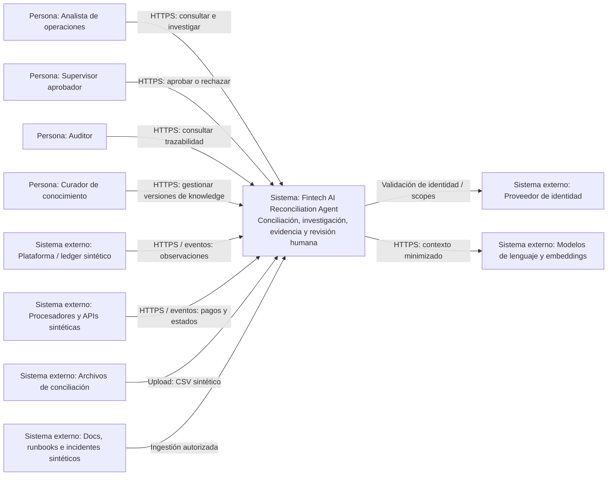
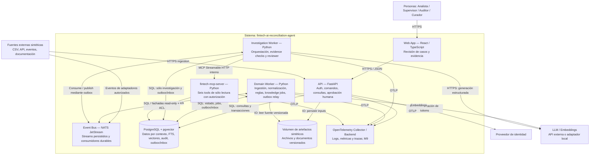

# Modelos C4

Diagramas Mermaid con semántica de C4: personas, sistemas, contenedores, responsabilidad y protocolo. Describen la arquitectura objetivo M0–M10; no el estado implementado. Un contenedor C4 es una unidad ejecutable o de almacenamiento, no necesariamente un Docker container.

## C4 context

No hay flecha de ejecución financiera hacia el ledger/procesador: todos los conectores operativos del MVP son de lectura/recepción. Proveedor de identidad externo es requerido para demo pública; en local se prevé identidad de desarrollo explícita y restringida a loopback.

## C4 container model

Los roles DB limitan cada proceso; el agente no tiene permisos sobre decisiones humanas ni registros transaccionales. El servidor MCP accede sólo a vistas/fachadas autorizadas de dominio y knowledge. Provider status usa snapshots sintéticos persistidos en el MVP. El bus no se expone a Internet. El worker publica eventos propios por outbox; las flechas al bus no habilitan dual writes sin atomicidad.

M0 prepara únicamente API, DB y bus y su validación técnica. El resto se incorpora según roadmap. El dashboard se despliega como estáticos; API y MCP usan autenticación diferenciada. El protocolo local MCP también admite stdio para desarrollo, manteniendo el mismo contrato de tools.
